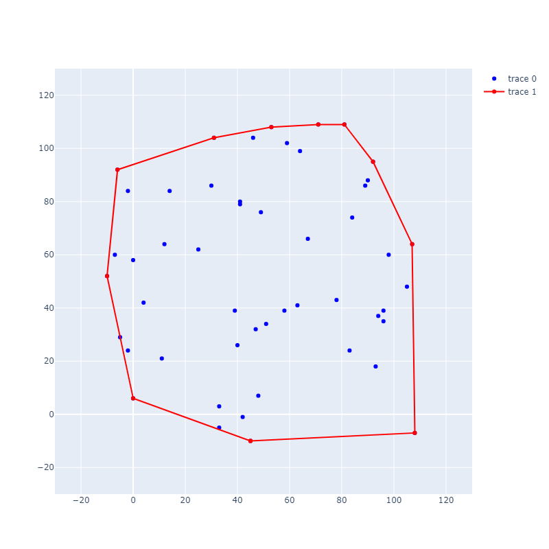

# Graham scan

Нахождение выпуклой оболчки конечного набора точек на плоскости методом
[сканирования Грэхэма](https://en.wikipedia.org/wiki/Graham_scan) на Python.

Запуск программы:
```console
$ python3 ./main.py <путь к файлу с координатами точек>
```

Файл, который передается данной программе, содержит набор точек в виде
набора строк, каждая из которых состоит из двух чисел -- абсциссы и ординаты
точки.

Например:
```
0 0
2 0
1 1
```

Программа печатает точки исходного набора, по которым
определяется результирующая выпуклая оболочка.

## Визуализация


Для визуализации результата необходимо установить Plotly:
```console
$ python3 -m pip install plotly
```

Затем запустить скрипт visualize.py с передачей файла, содержащего координаты
точек:
```console
$ python3 ./visualize.py <путь к файлу с координатами точек>
```